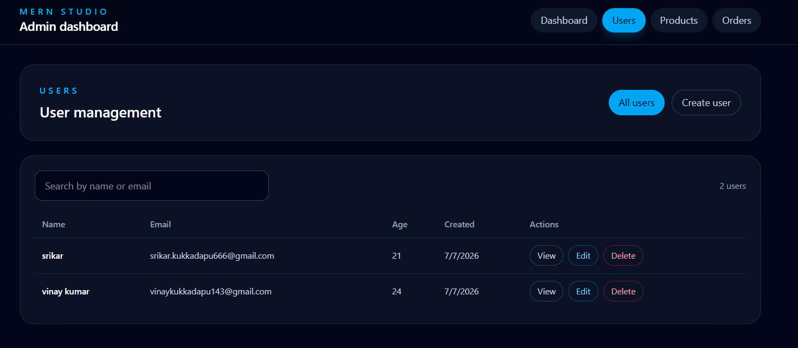
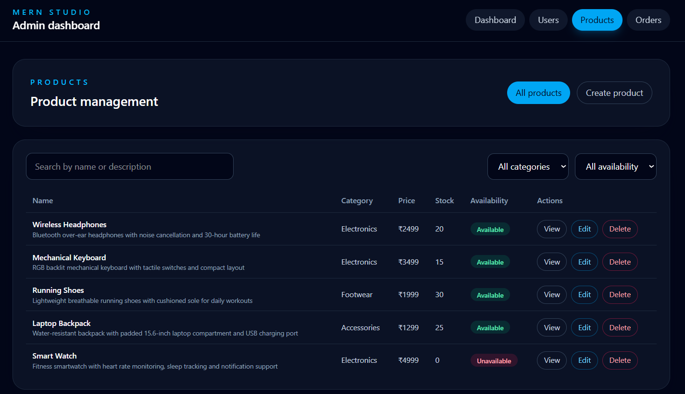
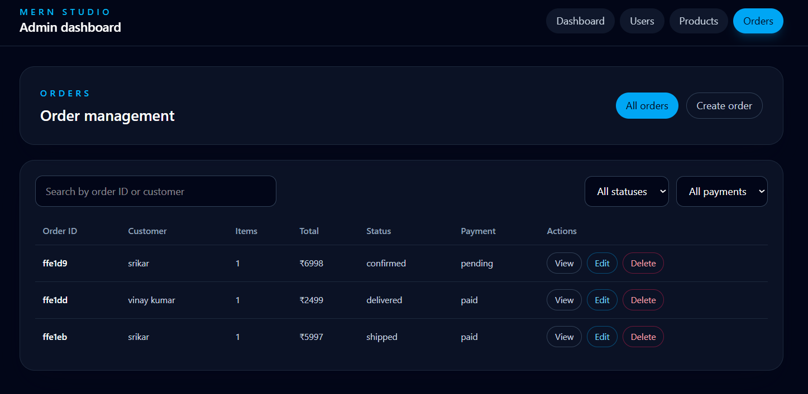
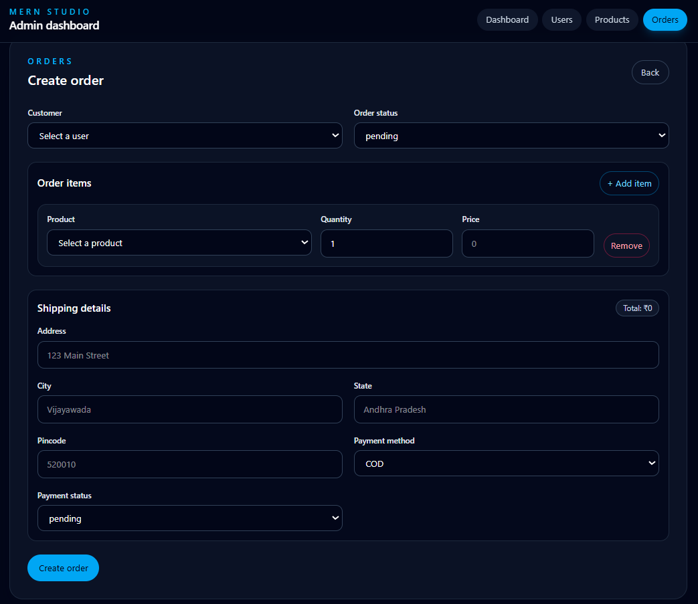
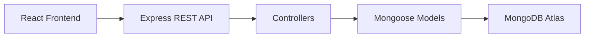
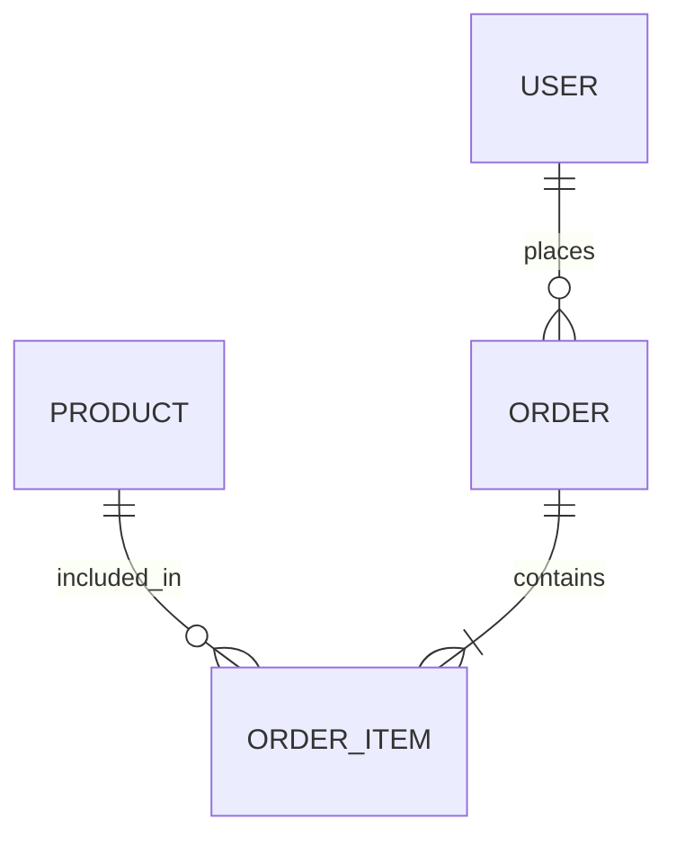

# MERNexus — Full-Stack CRUD Admin Dashboard

MERNexus is a full-stack admin dashboard built with the MERN stack for managing users, products, and orders from a single interface. The application uses an Express and Mongoose backend to expose REST APIs over MongoDB, while the React frontend provides a polished dashboard for creating, viewing, updating, and deleting records.

## Documentation

- [Backend documentation](backend/README.md)
- [Frontend documentation](frontend/README.md)

## Project Overview

This project demonstrates a practical CRUD workflow for an internal admin system. The frontend is a React + Vite application with Tailwind-based UI components, and the backend is an Express server that connects to MongoDB through Mongoose models. The app currently supports three core resources:

- Users
- Products
- Orders

Each resource is managed through dedicated pages that call the backend API and render success, error, loading, and confirmation states.

## Features

- User CRUD operations from the UI
- Product CRUD operations from the UI
- Order CRUD operations from the UI
- Dashboard summary cards for users, products, and orders
- Search and filtering for users, products, and orders
- Product and user selection when creating orders
- Dynamic order items with quantity and price handling
- Delete confirmation modals for destructive actions
- Responsive Tailwind interface with loading and alert states

## Screenshots

Screenshots can be added in the future under the following structure:

- 

- 
- 
- 
- 

> Placeholder paths are included because no screenshot assets are currently stored in the repository.

## Tech Stack

| Layer | Technology |
| --- | --- |
| Frontend | React, Vite, Tailwind CSS |
| Backend | Node.js, Express.js, Mongoose |
| Database | MongoDB Atlas |
| Package Management | npm |
| Version Control | Git, GitHub |

## Architecture

The frontend communicates with the backend over HTTP/JSON, and the backend routes requests into controllers that operate on Mongoose models before persisting data in MongoDB.



## Project Structure

```text
MERN_Project/
├── backend/
│   ├── src/
│   │   ├── controllers/
│   │   ├── model/
│   │   ├── routes/
│   │   └── config/
│   ├── server.js
│   └── package.json
├── frontend/
│   ├── src/
│   │   ├── components/
│   │   ├── pages/
│   │   └── services/
│   ├── package.json
│   └── vite.config.js
```

## Data Model Relationships

The backend uses three Mongoose models:

- User: stores basic profile information such as name, email, and age.
- Product: stores product details including name, description, price, category, stock, and availability.
- Order: stores a user reference, an array of ordered products, a total amount, shipping details, payment details, and status.

Orders link to users and products through MongoDB ObjectId references. The backend order controller uses Mongoose populate calls to resolve the related user and product documents when returning order data.



## Getting Started

### Prerequisites

- Node.js and npm installed
- A MongoDB Atlas cluster (or another MongoDB instance reachable by the backend)

### 1. Clone the repository

```bash
git clone <repository-url>
cd MERN_Project
```

### 2. Backend setup

```bash
cd backend
npm install
```

Create a .env file in the backend directory and set the MongoDB connection URI and the port if needed:

```env
MONGODB_URL=your_mongodb_atlas_connection_string
PORT=4000
```

Start the backend:

```bash
npm run dev
```

### 3. Frontend setup

```bash
cd ../frontend
npm install
```

Create a .env file in the frontend directory if you want to override the default API base URL:

```env
VITE_API_BASE_URL=http://localhost:4000
```

Start the frontend:

```bash
npm run dev
```

## Environment Variables

| Location | Variable | Purpose |
| --- | --- | --- |
| Backend | PORT | Express server port |
| Backend | MONGODB_URL | MongoDB connection string |
| Frontend | VITE_API_BASE_URL | Base URL for API requests |

## API Overview

| Method | Endpoint | Description |
| --- | --- | --- |
| POST | /users | Create a user |
| GET | /users | Get all users |
| GET | /users/:id | Get a user by ID |
| PUT | /users/:id | Update a user |
| DELETE | /users/:id | Delete a user |
| POST | /products | Create a product |
| GET | /products | Get all products |
| GET | /products/:id | Get a product by ID |
| PUT | /products/:id | Update a product |
| DELETE | /products/:id | Delete a product |
| POST | /orders | Create an order |
| GET | /orders | Get all orders |
| GET | /orders/:id | Get an order by ID |
| PUT | /orders/:id | Update an order |
| DELETE | /orders/:id | Delete an order |

## CRUD Workflow

The UI exposes CRUD actions through dedicated list, detail, create, and edit views for each resource. The dashboard provides quick access to the main sections, while the management pages include forms, validation feedback, search filters, and delete confirmation dialogs.

## Future Improvements

Potential future enhancements include:

- Authentication and authorization
- Pagination and server-side filtering
- Image uploads for products
- Inventory transaction handling
- Automated testing and CI/CD
- Deployment for both frontend and backend

## Author

Srikar Kukkadapu

## License

No license has been specified for this repository yet.
